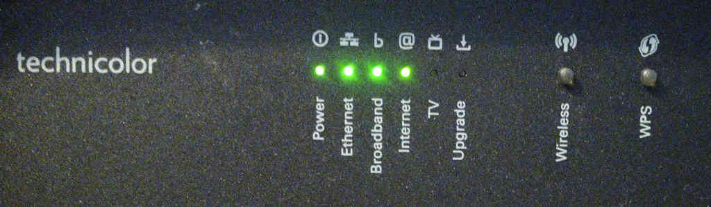

+++
date = "2018-05-14"
title = "Using a Technicolor TG588v Router in Bridge Mode With Zen Internet"
draft = false
categories = ["networks"]
topics = ["broadband","modem","bridged router","Technicolor TG588v v2"]
technologies = ["LAN","WAN"]
+++

## What's the problem?

The [Technicolor TG588v v2](https://www.provu.co.uk/technicolor-tg588v-v2.html) router [Zen Internet](https://www.zen.co.uk/) 
recently supplied me to use in bridge mode needed a bit of fiddly setting up. I thought I'd share my solution in the 
hope it helps others and serve as an aide-mémoire for the future.

### Background

I recently changed my broadband service to 
[fibre to the cabinet](https://www.thinkbroadband.com/guides/fibre-fttc-ftth-broadband-guide) with Zen Internet. 
I opted for them to provide me with a router/modem that supported bridge mode as I wanted to continue to use 
my existing [Netgear R7000](https://www.netgear.com/home/products/networking/wifi-routers/R7000.aspx) as my main router. 
As their standard issue [FRITZ!Box 3490](https://en.avm.de/products/fritzbox/fritzbox-3490/) apparently doesn't
support bridge mode they supplied me with a Technicolor TG588v v2 instead.

The supplied router didn't come with any documentation and when I contacted Zen they assured me it was ready to work
"out of the box" without any further configuration. As this wasn't my experience and I couldn't find information elsewhere
I've documented my solution below.

### My Configuration

The Technicolor TG588v v2 was supplied to me with 15.43.6330-1341001 version firmware installed. It has the functionality
to update it but I have been unable to track down a newer version anywhere. My Netgear R7000 is running 
[Tomato firmware](http://tomato.groov.pl/).

## My Solution

### Step One - Connecting Things Up

This assumes you already have a router with your networked devices setup and running. If not - go do that and come back.
I'll wait.

* Plug a [microfilter](https://en.wikipedia.org/wiki/DSL_filter) in to your phone socket.
* Connect the DSL port on the Technicolor to the modem port on the microfilter using an RJ11 cable.
* Connect one of the LAN ports on the Technicolor to the WAN port on your router using an RJ45 cable.
* Connect the power adapter to the Technicolor and power it on.

You after a few seconds you should see the LED status array as shown below:

The `Ethernet` LED may be flashing. That's OK as it denotes traffic being exchanged between the two routers.

The `Broadband` LED should be static green. If not there may be an issue with your connection. If it's flashing red 
there is no broadband connection detected. If it's flashing green the broadband is trying to connect.

The `Internet` LED will be flashing red.

### Step Two - Setting Up Subnetworks

**If your existing network is using any [subnetwork](https://en.wikipedia.org/wiki/Subnetwork) address range other than 
192.168.1.0/24  you can skip this step.**

This step depends on the configuration of your existing network. The default IP address for the Technicolor is 
192.168.1.1. My existing network was already configured to use the 192.168.1.0/24 subnetwork. As we ultimately want the 
Technicolor and our existing networks on separate subnets we'll need to reconfigure one of them.

You can reconfigure the Technicolor by following these steps:

* Connect the LAN port on your computer directly to a LAN port on the Techncolor using a RJ45 cable.
* Enable [DHCP](https://en.wikipedia.org/wiki/Dynamic_Host_Configuration_Protocol) on your computer if it isn't already 
  and wait for it to get assigned an IP address by the Technicolor.
* Once an IP is assigned, open a browser and enter [http://192.168.1.1](http://192.168.1.1).
* Click `Sign in` and enter `admin` for username and the access key from the back of the Technicolor as password.
* Hover over `Local Network` and click the cog icon.
* For `Local Device IP address` enter your chosen new IP address for the Technicolor. I went for `192.168.0.1`. Make 
  sure whatever IP address you choose is on a different subnetwork to your other router.
* Switch `DHCP Server` to off.
* Click `Save`.
* Disconnect your computer from the Technicolor's LAN port and reconnect it to your existing router. Also connect the 
  two routers if they aren't currently connected.
* When you're succesfully connected and setup on your existing network you can continue.

### Step Three - Connecting the Technicolor to the Internet

* Enter the Technicolor's IP address in a browser. Use the new IP you assigned it in step two (in my case 
  [http://192.168.0.1](http://192.168.0.1)) or [http://192.168.1.1](http://192.168.1.1) if you skipped it.
* Click `Sign in` and enter `admin` for username and the access key from the back of the Technicolor as password.
* Under `Internet Access` it should say `Gateway in Bridge Mode` and under `Broadband` it should say `Connected`.
* Click on `Setup Your Gateway` under `Gateway`.

You should be presented with the following dialog:

* Choose `PPPoE` from the drop down under `Routed Type`.
* Enter your user details as provided by Zen.

The dialog should look similar to the following:

* Click on `Save` and wait for the Technicolor to connect. It will say `Connected` underneath `Internet Access` when
  it has.

Once connected the LED status array should look like this:

### Step Four - Setting Up The Bridge

* On the Technicolor admin dashboard click on `Setup Your Gateway` under `Gateway`.
* Choose `Bridge` from the drop down under `Routed Type`.
* Click on `Save`. It should say `Gateway in Bridge Mode` underneath `Internet Access`.

**Now you need to setup your existing router's WAN settings to connect to internet. This varies depending on the device and 
firmware but you should choose `PPPoE` connection type and enter your user details as provided by Zen for it to work.**

All being well once everything is connected and working properly the status LEDs on the Technicolor should look like this:

## TL;DR

The Technicolor router needs to be setup and connected to the internet in PPPoE mode then switched back in to Bridged
mode for it to work in Bridge mode effectively.
